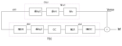
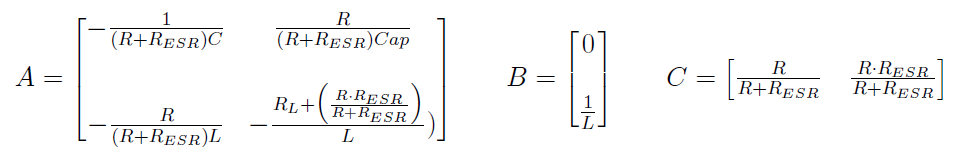

# Digital control 

## Why we need to Control DC/DC converter?

The DC-DC converter inputs are unregulated DC voltage input (Vin) and the required outputs (Vout) should be a constant or fixed voltage (voltage regulation). A control system for the converter is needed to maintain the output voltage of converter constant irrespective of variations in the DC source voltage (Vin) and the load variations.

There are many Analog and Digital control methods used for DC-DC converters which are further classified as Voltage-mode and Current-mode control techniques.

## Difference between Voltage mode Control and Current mode Control:

Voltage mode and Current mode are the two regulating scenario that can be used to control the output of the converter.

### Voltage Mode Control:

Converter's output voltage remains constant when the current is drawn from zero to the full rated current of the converter. Voltage mode control is the most basic method, in which the output voltage is sensed and returned through a feedback loop. The sensing of the voltage is easy and typically done using a resistive divider that scales the output voltage to a value which is read by an ADC or directly fed to Analog comparator. The actual output voltage is compared with respect to the Reference output voltage and the difference (error) voltage is used to change the pulse width of the PWM signal to control the voltage across the inductor. The controller design is relatively easier as the only output voltage is being monitored and hence it requires only one feedback path.

### Current Mode Control:

Current-mode utilises the error between the desired and actual output voltages to control the peak current through the inductor. This mode has fast response compared to that of the voltage mode as the current in the inductor is controlled. Inductor current responds directly with changes in input and output voltages. This mode provides current limiting on a cycle by cycle basis. An advantage of current-mode control is that it eliminates the loop-gain variation with the input voltage. The first disadvantage of current-mode control, it requires two feedback paths which in turn increase the complexity and cost of the system. And also the instability of the control loop carrying inductor current at duty cycles above 50% is a major issue. The second disadvantage, accurate sensing of current is difficult. For this purpose, a very low resistor is placed in series with inductor and voltage drop across this resistor is an indication of the current. The voltage is of milli-volts hence requires amplification.

## Difference between Analog Controller and Digital Controller

An analog or digital controller closes the loop around the switching converter and controls the turn ON and OFF states of the switching transistor devices to achieve regulation. 

### Analog Controller:

Figure 1 shows a generic analog controller that provides voltage regulation.

<figure>
 

 
 <figcaption>Fig.1 Analog Controller</figcaption>
 

</figure> 

In analog controllers, UVLO comparator is used whose input is strictly analog and the output is digital signal i.e. either high (1) or low (0). Depending upon this value the analog PWM increases or decreases the duty cycle of the power stage. But the output of the comparator carries limited information of parameter (i.e whether the monitored value is above or below the threshold value) and does not carry any information regarding the amount of the deviation from the threshold which results in less precise controlling of the parameter.

### Digital Controller:

Figure 2 shows a generic digital controller that provides voltage regulation.

<figure>
 

 
 <figcaption>Fig.2 Digital Controller</figcaption>
 

</figure>

This type of controller uses standard communication block, processing unit, power management, memory, I/O's and general-purpose ADCs. These controllers are not only capable of doing regulation but also can perform complex algorithms to monitor and maintain few parameters within permissible limits.

The three main blocks of this controller are ADC which samples the error voltage with respect to the reference voltage, Digital filter which is used to compensate the error and Digital Pulse width modulator which converts the compensated signal into Transistor gate drivable signals.

The advantage of the digital controller is the flexibility to decide the right course of action to given stimuli but at the same time, these decisions have to be programmed in firmware by the designer. However, in the case of analog controllers, these decisions were made available by the semiconductor manufacturers.

## Modelling the Digital controller: 
To design the controller for any system, it is necessary to know system behaviour. This is nothing but a mathematical description of the relation among inputs to the process state variables and output. When we add any digital components into the system, we need to consider few effects like feedback quantisation, control effort quantization, the delay involved in sampling the feedback signal and time to calculate the control effort.

Figure 3 shows the closed-loop block diagram of the digitally controlled DC-DC converter. 

<figure>
 

 
 <figcaption>Fig.3 Closed loop system</figcaption>
 

</figure> 

The closed-loop gain, from the PWM control effort (u) to the sensed output voltage ($V_{sense}$), is given by

$$\frac{V_{sense}}{u}=\frac{G(s)}{1+ G(s)H(s)}$$

The total open-loop gain of the system is given by

$$T(s)=G(s)×H(s)$$

The parameters that are included in closed loop systems:
- $K_{EADC}$ : ADC gain in LSB/volt
- $K_{NLR}$ : Nonlinear gain 
- $G_c$ : Compensator Gain 
- $G_{delay2}$ : Total sampling time and computational time
- $K_{PWM}$ : PWM gain in duty/LSB 
- $G_{delay1}$: On-time 
- $G_{Plant}$ : Transfer function of Power stage(at point of falling edge of the PWM signal to Vout)
- $G_{Div}$ : Divider network transfer function in V/V
 
### Plant Modelling Gplant(s): 

Modelling of the plant can be done using average model or discrete-time Model. Time-domain modelling is necessary to know the effects of quantisation.

#### Average Model:

The effect of variations in input voltage, load current and duty cycle must be considered in the time-domain model of the system. Normally dc-dc converter will have non-linear devices hence the system need to be linearized while designing the linear controller. The most common approach is to use average modelling of the system.

Switch averaging removes the switching ripples in the inductor-current and capacitor voltage waveforms over the switching period. The differential equations for capacitor voltages and inductor currents are obtained and averaging them over each switching interval results in desired average equations. This average equation does not include delay associated with sampling which is done once per switching period. To include the delay, the equation is modified and is given by :

$$G_{vd-delay}(s) = e^{{t_d}s}G_{vd}(s)$$

$G_{vd}(s)$ is the control input to output voltage transfer function found using average model and td is the delay between output voltage sampling instance and falling edge of the switching transistor in case of trailing edge modulation. 

For more information on the average modelling, please refer [1] 

#### Discrete Model:

An average model does not include the effects of quantization and non-linear gain. The discrete-time model takes into account the sampling, modulator effects and delays in a digitally controlled converter.

The simplified circuit for modelling is considered as shown below in figure 4 where the sensing gain is 1.

<figure>
 

 
 <figcaption>Fig.4 DC DC convertor with digital control (simplified model)[2]</figcaption>
 

</figure> 

The converter operates in continuous-conduction mode. In each state of the switch (1 or 2), the converter circuit is linear, time-invariant. We can express the state-space description as follows:

$${\dot x} = A_i \cdot x + B_i \cdot Vg$$

$$vout = C_i \cdot x + E_i \cdot Vg$$

$$i = \{1,2\}$$

- $x$ is a vector of converter states which includes inductor current and capacitor voltage,
- $A_i$ is State matrix,
- $B_i$ is Input-to-state matrix,
- $C_i$ is State-to-output matrix,
- $E_i$ is Feedthrough matrix,

As output voltage regulation is the focus here, we assume that the input voltage is being constant. The ADC is configured to take samples of the error output voltage at a rate equal to the switching frequency. As shown in figure 4, the error signal samples are then processed by a discrete-time compensator. The compensated signal is fed to a digital pulse-width modulator (DPWM) which changes the duty cycle. There are 2 samplers in the feedback loop: one sampling is done by ADC and one sampling is done by DPWM.

Few parameters:
- $f_s$ = switching frequency,
- $T_s$ = switching period,
- $t_s$ = time instance of ADC sampling,
- $t_p$ = time instance of DPWM sampling,
- $t_d$ = total delay,
- $D$ = duty cycle,
- $D' = 1 - D$ 

<figure>
 

 
 <figcaption>Fig.5 Waveform of discrete time model derivation at sampling during 2nd interval.[2] </figcaption>
 

</figure> 

As shown in figure 5, there is a delay ($t_d$) between the time instance of ADC sampling ($t_s$) and time instance of DPWM sampling ($t_p$). The total delay ($t_d$) is given by 

$$t_d=conversion\;time\;of\;ADC + computational\;delay\;in\;Compensator + Modulator\;delay$$

Assumption is that $t_d \lt T_s$. ADC Sampling can be done at interval 1 ($0\le t_d \lt DT_s$) or interval 2 ($DT_s \le t_d \lt T_s$). Modulation of DPWM can be at trailing edge or leading edge. Here sampling at interval 2 and trailing edge modulation is being considered.
The small-signal discrete- time model is given by :

$$\hat x[n] = \phi \hat x[n -1] + \gamma \hat d[n -1]$$

where matrix and vector coefficients are found by analysing the effect of perturbations during converter states and are as shown in table 1.

<figure>
 

 
 <figcaption>Table 1. Discrete time small signal parameters [2]</figcaption>
 

</figure> 

The parameter $\alpha$ is given by :

$$\alpha = (A_1 - A2)X_p + (B_1 - B_2)V_g$$

The small output state-space equation is given by :

$$\hat y[n] = C_i \hat x[n]$$

By taking the Z transform, we can get the discrete-time control-to-output transfer functions of the converter.

##### Discrete model for the buck converter:

State matrices are given by :

- $A_1 = A_2 = A$
- $B_1 = B$, $B_2 = 0$
- $C_1 = C_2 = C$ 
- $E_1 = E_2 = 0$

<!--

Please update these matrices equation when it is supported by Mathjax and then delete the image state_matrices

$$ A = \begin{bmatrix} -\frac{1}{(R + R_{ESR})C} & \frac{R}{(R + R_{ESR})Cap} \\-\frac{R}{(R+R_{ESR})L} & -\frac{R_L + \big(\frac{R\cdot R_{ESR}}{R + R_{ESR}}\big)}{L}) \end{bmatrix}$$

$$ B = \begin{bmatrix} 0 \\ \frac{1}{L} \end{bmatrix}$$

$$ C = \begin{bmatrix} \frac{R}{R + R_{ESR}} \frac{R\cdot R_{ESR}}{R + R_{ESR}} \end{bmatrix}$$

-->

<figure>
 

 
 

</figure> 

Equations reduces to:

$$\hat x[n] = \phi \hat x[n -1] + \gamma \hat d[n -1]$$

$$\alpha = BV_g$$

$$\phi = e^{AT_s}$$

$$ \gamma = e^{A(T_s-td)} \alpha T_s$$

$$\hat y[n] = C_i \hat x[n]$$

By taking the Z transform of the above equation, the control to output transfer function can be found

$$G_{vd}(z) = \frac{\hat y}{\hat d} = \frac{\hat V_{out}}{\hat d} = \frac{C \cdot \alpha \cdot z^{-1}}{(I - \phi \cdot z^{-1})}$$

For the direct computation of control to output transfer function (trailing edge PWM), the below table 2 can be used. $N(z)$ is the numerator and $D(z)$ is the denominator of control to the output transfer function of buck convertor

<figure>
 

 
 <figcaption>Table 2. Polynomials for control to output transfer function (Trailing edge PWM)[2] </figcaption>
 

</figure> 

For more information on the discrete modelling, please refer [2].

## Modelling of divider circuit Gdiv(s):

After the power stage, the voltage divider as shown in Fig.6 is used to scale the output of the converter to ADC range. By adding caps we can introduce compensating zero and pole which acts as an anti-alias filter.

<figure>
 

 
 <figcaption> Fig.6 Divider circuit </figcaption>
 

</figure> 

A compensation zero can be created by including a capacitor in the Cz location. Adding Cp will attenuate the frequency above half of the sampling rate of ADC and compensator. The Cp can be calculated by 

$$C_p = \frac{1}{\frac{R_1R_2}{R_1+R_2}\cdot 2 \pi f}$$

The transfer function is given by 

$$G_{div}(s) = \frac{R_2}{R_1+R_2} \cdot \Biggl( \frac{R_1 C_z s + 1}{\frac{R_2}{R_1+R_2} R_1 (C_z + C_p) s + 1} \Biggl)$$

The transfer function needs to be translated to the z domain for discrete-time modelling of the divider circuit. This is done by bilinear transformation, hence 

$$s = 2 f_{s} \biggl( \frac{z-1}{z+1} \biggl)$$

By replacing s by above equation we get $G_{div}(z)$. This can also be done using "<a href="https://in.mathworks.com/help/control/ref/c2d.html">MATLAB function c2d</a>". 

This transfer function $G_{div}(z)$ is then multiplied with the power stage's discrete transfer function $G_{vd}(z)$ to calculate the Transfer function $G(z)$.

## Modelling of Compensator H(s): 

::: warning TODO
- Explain main function of the compensator (control theory)
- Explain the stability condition and requirements for compensator
- Explain the need of compensator Cz in divider cirucit
:::

<header>
    <h1>References:</h1>
</header>

[1] <a href="http://www.ti.com/download/trng/docs/seminar/Topic_7_Hagen.pdf">Applying Digital Technology to
PWM Control-Loop Designs</a>.

[2] <a href="https://ieeexplore.ieee.org/document/4371555">Small-Signal Discrete-Time Modelling of Digitally Controlled PWM Converters</a>

