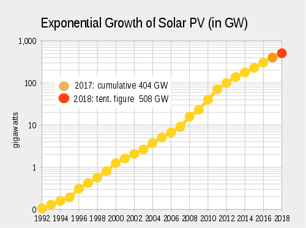
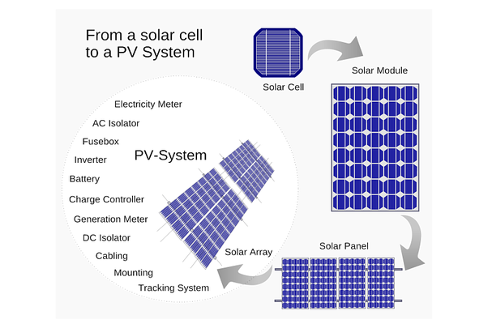
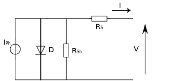

# Solar Panels

## Introduction

  The first thought that comes to the mind when someone thinks about alternative or renewable energy is usually large **solar panels** on the rooftop of their housing. These **solar panels**, also known as **photovoltaic modules (PV modules)**, convert sunlight into electricity which is considered to be the main source of renewable energy for decades.

  

  **Over the years,** photovoltaics has gradually gained wide popularity as an alternative way to produce electricity.
  There has been a meteoric exponential rise of the photovoltaics technology with no sign of a slowdown as shown in the figure below. the reason behind this explosion comes back to the increase of electricity costs which pushed the end-users more towards the usage of solar systems which would allow them to reduce their bills by generating their own electricity and feeding the excess power back into the grid as as a way of receiving payments for the renewable electricity they generate, called as Feed-in-tarrifs. However, exporting electricity to the grid is no longer a remunerative approach due to fluctuated Feed-in-tarrifs rates so the end-users now tend to use solar power to reduce their own energy consumption and in return their life expenses. When power is drawn from the electrical grid at a flat rate, there is no need to store that solar power.
  
  
  
  [Exponential growth-curve on a semi-log scale of worldwide installed photovoltaics in gigawatts since 1992](https://de.wikipedia.org/wiki/Datei:PV_cume_semi_log_chart_2014_estimate.svg)

## How do Solar Panels Work ?

 A solar panel (PV module), as a basic definition, is a device that will generate electricity flow under sunlight. the generated electricity can then be used to either charge batteries or power  electrical devices, Solar panels can also be used directly in systems without the need for batteries usage. Most solar panels are framed in aluminum, overlapped with tempered glass and secured by a waterproof backrest. they are composed of smaller units called solar cells where crystalline silicon is sandwiched between conductive layers. each silicon atom is connected to its neighbours by four strong bonds, which keep the electrons in place so no current can flow.  the key behind this is a silicon solar cell uses two different types of silicon; an n-type silicon which has extra electrons and p-type silicon has extra spaces for electrons, called holes. where the two types can meet, electrons can wander across the p/n junction, leaving a positive charge on one side and creating negative charge on the other. You can think of light as the flow of tiny particles called **photons** shooting out from the Sun. when one of these photons strikes the silicon cell with enough energy, it can knock an electron from its bond, leaving a hole. The negatively charged electron and location of the positively charged hole are now free to move around but because of the electric field at the p/n junction, they will only go one way, the electron is drawn to the n-side while the hole is drawn to the p-side. The mobile electrons are collected by thin metal fingers at the top of the cell. From there, they flow through an external circuit, doing electrical work, like powering a lightbulb, before returning through the conductive aluminum sheet on the back. Each silicon cell only puts half a volt, but you can string them together in modules to get more power. For instance, twelve photovoltaic cells are enough to charge a cellphone, while it takes many modules to power an entire house. Electrons are the only moving parts in a solar cell and they all go back where they came from. There's nothing to get worn out or used up, so solar cells can last for decades

[Tssenthi [CC BY-SA 4.0 (https://creativecommons.org/licenses/by-sa/4.0)]](https://commons.wikimedia.org/wiki/File:Silicon_solar_cell.gif)

## Cell Technology

There are several technologies used to produce solar cells, the smallest units that together build the solar modules. the common types  used currently in the market are as follow:  

**Monocrystalline solar panels:** Can be classified as the most efficient and expensive solar panels as they are made with Monocrystalline cells. These solar cells use very pure silicon and involve a complicated crystal growth process. Long silicon rods are produced which are cut into slices of .2 to .4 mm thick discs or wafers which are then processed into individual cells that are wired together in the solar panel. Monocrystalline solar cells are about 13-16% efficient at converting sunlight to electricity.

**Polycrystalline solar panels:** Often called Multi-crystalline, solar panels made with Polycrystalline cells come in the second place after monocrystalline panels as are slightly less in the efficieny (11-14%) and cost as the cells are not grown in single crystals but in a large block of many crystals. This is what gives them that striking shattered glass appearance. Like Monocrystalline cells, they are also sliced into wafers to produce the individual cells that make up the solar panel.

**Amorphous solar panels:** Not really crystals, but a thin layer of silicon deposited on a base material such as metal or glass to create the solar panel. The cost is much cheaper than monocrystalline and polycrystalline panels , but their energy efficiency is proportionally much less (usually 7-10%) so more square footage is required to produce the same amount of power as the Monocrystalline or Polycrystalline panels.

**String Ribbon solar panels** use less silicon than the other types in the manufacturing process, yet achieve high effeciencies range between 12-14%

**CIGS Solar panels** the Copper Indium Gallium di-Selenide technology uses no silicon at all and can be made into panels with or without cells

Additionally, There are also **hybrid solar panels** under research and development which use both crystalline and thin-film technologies to increase the energy capture; these modules have the potential to boost the efficiency up to 19% with low costs. However, for the foreseeable future, the previous five types mentioned represent what is commercially available.

## Solar Electrical Characteristics

PV panels produce direct current electricity (DC), the same type of electricity that is produced by batteries. The home appliances, on the other hand, use alternating current (AC). DC electricity flows in one direction only, while AC electricity changes direction rapidly.
In order to use solar electricity to power household devices, a solar inverter, which coverts DC to AC, is required.
A small system to charge batteries or power small electrical devices like cell phones do not require an inverter, but be sure to use the correct adapters and voltage converters if needed.

A basic primer on electricity will help make all of this clear:

**Volt** - Unit of electrical potential.

**Ampere** - Rate of Current Flow.

**Watt** - Rate of Energy Supply or Consumption.

So now, let's look at these values in terms of energy and power:

**Power** is the rate at which energy is supplied - like the speedometer on your car - and this is measured in Watts.

**Energy** is the measure of power over time - like your car's odometer - and this is measured in watt-hours or killowatt-hours.
**Power (W) * Time (Hrs) = Energy (Watt-hours)**

The previous equation means that a higher-wattage solar panel will produce more energy over time than a lower-wattage panel. For instance, A 100 Watt solar panel will produce twice as much energy as a 50 Watt solar panel at the same location during the same period of time.

The rated wattage of a panel is equal to its operating voltage multiplied by its operating current as follows:
 **Watts = Voltage x Amps**

The amount of energy in Watt-hours that a panel will produce is a product of the wattage of the panel and the number of hours of full-intensity sunlight or the intensity it receives.

### Voltage and Solar Panels

**PV modules have three different voltage ratings:**

- **Nominal Voltage** refers to the voltage of the battery that the module is best suited to charge; this is a leftover term from the days when solar panels were used only to charge batteries. The actual voltage output of the panel changes as lighting and temperature conditions change, so there’s never one specific voltage at which the panel operates. Nominal voltage allows us, at a glance, to make sure the panel is compatible with a given system. 
- **Voltage at Maximum Power or $Vmp$** is the highest voltage the panel can produce while connected to a system and operating at peak efficiency.
- **Open Circuit Voltage  or $Voc$** is the maximum voltage that the panel can produce when not connected to an electrical circuit or system. Voc can be measured with a meter directly contacting the panel’s terminals or the ends of its built-in cables.

### Current and Solar Panels

**Panels also have two different current ratings:**

- **Current at Maximum Power or $Imp$**  Similar to Vmp, the maximum current available when the panel is operating at peak efficiency in a circuit.
- **Short Circuit Current or $Isc$** Similar to Voc, the short circuit current is the current measurement your meter would show when in contact with the positive and negative terminals of the panel while not connected to a system or load.

It’s worth mentioning also that solar modules’ wattage output rating is based on what the modules produce under laboratory-controlled conditions, called Standard Test Conditions (STC). STC allows solar panels to be compared to each other using the same metric. However, because these rated wattages represent ideal laboratory conditions, it's likely that the module will produce lower wattage in actual use.

**STC** includes three environmental parameters which affect the energy performance of a photo-voltaic (PV) system:

- **Irradiance** means sunlight intensity or power,measured in Watts per square meter falling on a flat surface. The measurement standard is 1,000 Watts/m2. The more irradiance striking a PV panel, the more electrical energy it will produce. Solar irradiance strongly affects the short-circuit current.
- **Air Mass** refers to “thickness” and clarity of the air through which the sunlight reaches the modules (sun angle affects this value). The standard is 1.5.
- **Cell temperature** differs from ambient air temperature. STC defines cell temperature as 25°C. the cell temperature mostly affect the open-circuit voltage.

and these aforementioned factors in return affect the maximum power point (MPP). Therefore, any reliable model of a photo-voltaic system must take into account these parameters before any performance or power investigation.

### Proposed Scalable Model of a PV Cell

The figure represents the equivalent five-parameters model of a PV cell whose descriptive equations can be found in the following [paper](https://www.mdpi.com/1996-1073/9/5/326/htm), where $Iph(A)$ is the light generated current measured in Amperes, $Rs(Ω)$ ,$Rsh(Ω)$ are series and shunt resistances respectively measured in Ohms, $D$ represents the Diode while $I$ and $V$ symbols represent the current and voltage of a solar cell.

## IV-PV Curves

### The current-voltage curve and the power-voltage curve of a solar panel

The default curves are based on an average 100 W / 36 cell monocrystalline solar panel, with the following specifications:
**100 W panel**

|            __Parameter__                           |    __Value__    |
| -------------------------------------------------- |:---------------:|
|            number of cells                         |       36        |
|      power at maximum power point "pmpp"           |       100 W     |
|     voltage at maximum power point "vmpp"          |       18 V      |
|     current at maximum power point "vmpp"          |       5.56  A   |
|         open circuit voltage "voc"                 |       21.6 V    |
|         short circuit current "isc"                |       6.12 A    |

__Maximum power point__: a condition when the module is connected to a load and is operating at its peak performance output under standard test conditions (STC).

<solar-panel-characteristic-curve/>

As shown in the previous figure, the power obtained from the panel is zero when it is short circuited (0 x Isc = 0) or when no current is drawn from the panel (Voc x 0 = 0).
In between those two zero power points the product P = V x I reaches a maximum: the Maximum Power Point (Pm = Vm x Im).

::: warning TODO

- Characteristic curve
- Temperature dependency
- Typical voltage levels for modules
:::

[1](#reference1)

<a name="reference1">1</a>:
